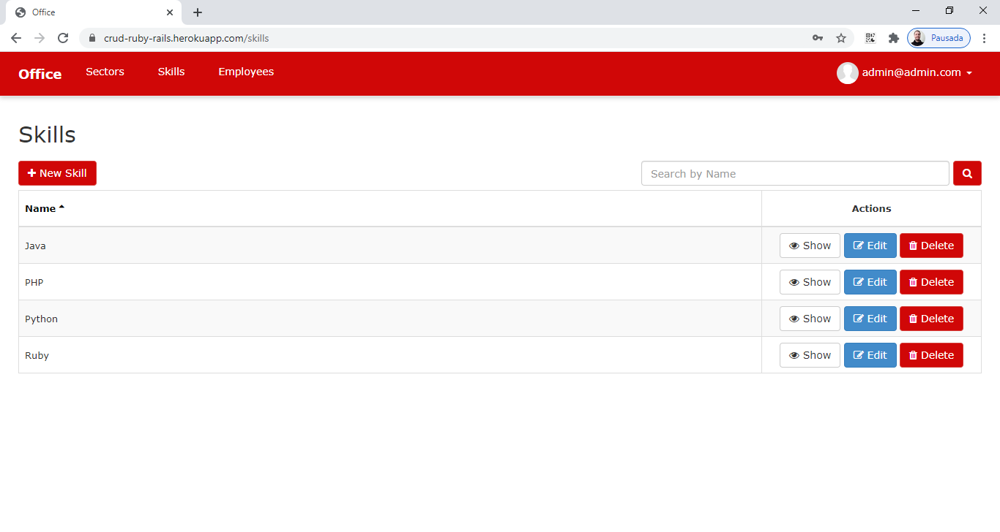
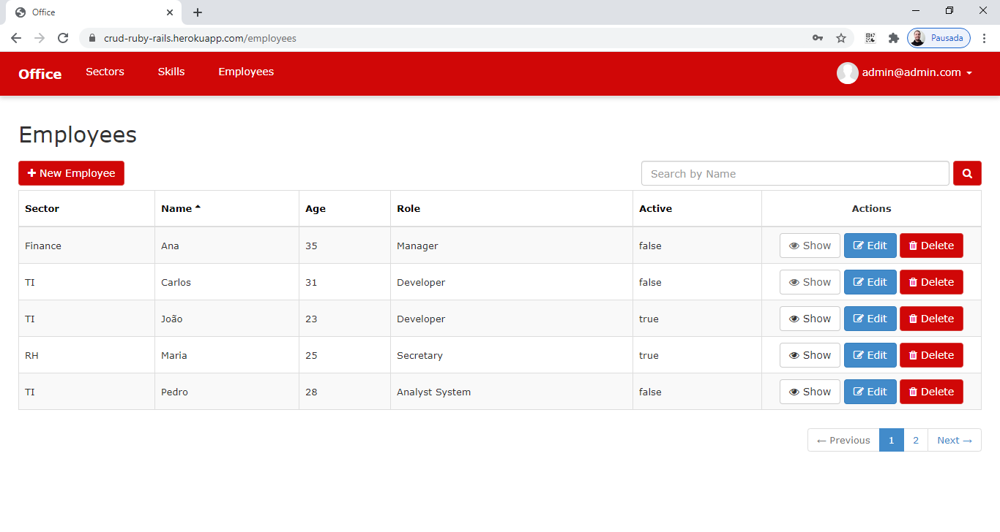

# Office

Project of an CRUD developed with Rails.

## Features

- CRUD
- MVC
- Active Record
- Search
- Sort Column
- Paginate
- Routes
- Migrate

## Requirements

- Ruby >= 2.3.3
- Rails >= 5.1.6
- Gem >= 2.5.2

## Tecnologies

- Ruby
- Rails
- CSS and SCSS
- JS
- Bootstrap
- SQLite

## Installation

```
$ git clone https://github.com/danilomeneghel/ruby_on_rails.git

$ cd ruby_on_rails
$ rake db:migrate
```

After everything is done, run the project:

```
$ rails server
```

Finally open http://localhost:3000/ in your browser.

## Create new modules

```
$ rails g scaffold name_module field:type
```

## Routes

http://localhost:3000/rails/info/routes

## Demonstration

You can see the system working by clicking the link below:<br>
https://crud-ruby-rails.herokuapp.com/

- Login:
    - Email: admin@admin.com
    - Password: admin123

## License

This project is licensed under <a href="license.md">The MIT License (MIT)</a>.

## Screenshots

<br><br>
<br><br>
<br><br>
<br><br>
<br><br>
<br><br>
<br><br>
<br><br>


Developed by<br>
Danilo Meneghel<br>
danilo.meneghel@gmail.com<br>
http://danilomeneghel.github.io/<br>
